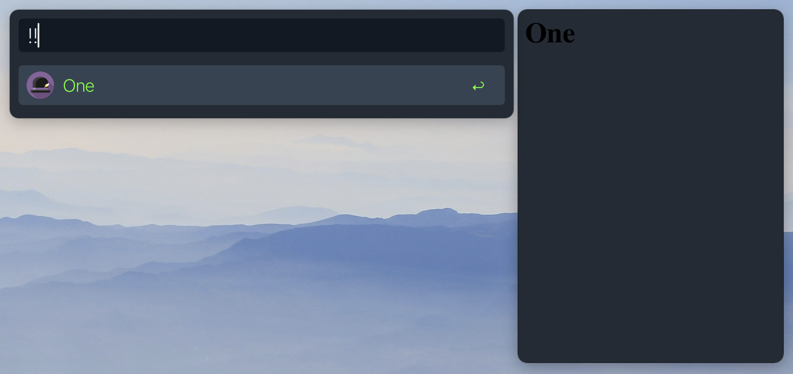

<h1 align="center">
  
<a href="https://github.com/mr-pennyworth/alfred-extra-pane/releases/latest/">
  <br/>
  <br/>
</a>
  AlfredExtraPane
</h1>

Spotight-like rich previews for [Alfred](https://alfredapp.com) workflows.


`AlfredExtraPane` is an experimental app that renders HTML from
`quicklookurl` of every item in the JSON produced by
[Alfred Workflows](https://www.alfredapp.com/workflows/).

#### How does it do it?
Alfred has an experimental "[Press Secretary](https://www.alfredforum.com/topic/16111-wip-poc-spotlight-like-rich-preview-pane-for-alfred-workflows/?do=findComment&comment=83222)" to publish
macOS [distributed notifications](https://developer.apple.com/documentation/foundation/distributednotificationcenter). These notifications
contain all the information needed to be able to show the extra pane.

#### Adding to workflow
Any workflow that produces items with `quicklookurl`s that are either
HTML files or HTTP links automatically causes the extra pane to show
up with the `quicklookurl` loaded in it.

#### Alfred theme support
Alfred's themes are stored in JSON files. Here's a snippet from one such file:
```json
{
  "alfredtheme" : {
    "result" : {
      "textSpacing" : 10,
      "subtext" : {
        "size" : 11,
        "colorSelected" : "#6E7073FF",
        "font" : "System Light",
        "color" : "#6E7073E5"}}}}
```

The pane converts this into CSS variables and injects them into the HTML.
The CSS looks like this:
```css
:root {
  --result-textSpacing: 10px;
  --result-subtext-size: 11px;
  --result-subtext-colorSelected: "#6E7073FF";
  --result-subtext-font: "System Light";
  --result-subtext-color: "#6E7073E5";
}
```
As a workflow author, when you generate the HTML, use these
variables in it. The pane will make sure they're injected.
Check out the [tutorial](#tutorial) for a quick walk-through.

## What's not yet supported?
 - Configurability
    - Workflows should be able to opt out of the extra pane
    - Workflows should be able to configure the position
      and dimensions of the pane

## Configuration
The appearance of the pane(s) can be configured by editing
`{/path/to}/Alfred.alfredpreferences/preferences/mr.pennyworth.AlfredExtraPane/config.json`

Here's an example with four panes configured:
```json
[{
  "workflowUID" : "*",
  "alignment" : {
    "horizontal" : {"placement" : "right", "width" : 300, "minHeight" : 400}}
}, {
  "workflowUID" : "*",
  "alignment" : {
    "horizontal" : {"placement" : "left", "width" : 300, "minHeight" : 400}}
}, {
  "workflowUID" : "*",
  "alignment" : {
    "vertical" : {"placement" : "top", "height" : 100}}
}, {
  "workflowUID" : "*",
  "alignment" : {
    "vertical" : {"placement" : "bottom", "height" : 200}}
}]
```


## Tutorial
Here's a script filter that produces a result:


This is what you get when you run it: 

Now, let's attch an HTML preview to this result.
Create `/tmp/one.html`:
```html
<html>
  <head>
  </head>
  <body>
    <h1> One </h1>
  </body>
</html>
```
Change the script filter:
```bash
cat << EOF
{"items" : [
  {"title": "One",
   "quicklookurl": "/tmp/one.html"}
]}
EOF
```
And the preview shows up!


Now let's make the preview blend-in with the theme.
Here's a snippet from relevant parts of Alfred's theme:
```json
{
  "alfredtheme" : {
    "result" : {
      "backgroundSelected" : "#00000054",
      "text" : {
        "size" : 22,
        "colorSelected" : "#E1E1E2FF",
        "font" : "System Light",
        "color" : "#A8A8ABFF"}}}}
```

Looking at the variable names in the above JSON, add the style section
to `/tmp/one.html`:
```html
<html>
  <head>
    <style>
      html {
          background-color: var(--result-backgroundSelected);
      }
      h1 {
          color: var(--result-text-colorSelected);
      }
    </style>
  </head>
  <body>
    <h1> One </h1>
  </body>
</html>
```

Themed previews should show up:

|  |  |
|-|-|
