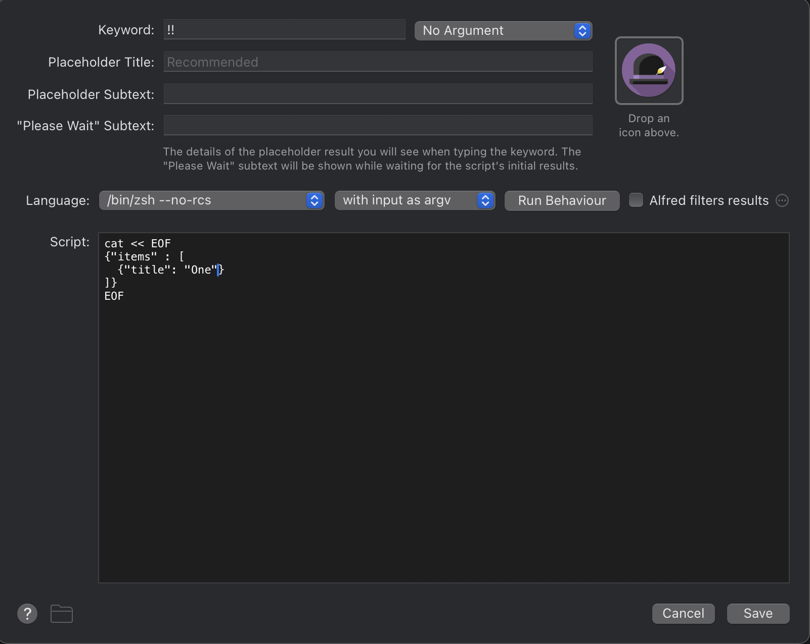
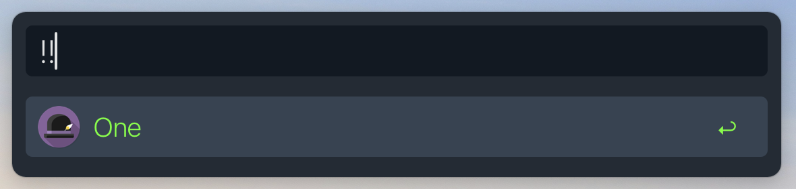

# AlfredExtraPane
Spotight-like rich previews for [Alfred](https://alfredapp.com) workflows.


#### What is this?
An app that workflow creators can add to their script filters

#### What does it do?
It renders html from quicklookurl of every item in the json.

#### How does it do it?
By intercepting the json and by monitoring the following three:
  - up-arrow and down-arrow keypresses
  - ctrl-p and ctrl-n keypresses
  - mouse hover over alfred results

#### How to add it to a workflow?
By adding it to the script filter.
Here's an example (from the workflow in the above GIF):
notice how everything remains the same, just that at the very end,
json needs to be piped through the helper app

```bash
# Before:
items=$(curl 'http://localhost/search' --data "{ \"q\": \"$query\" }" | jq '.hits')
echo "{ \"items\": $items }"

# After:
items=$(curl 'http://localhost/search' --data "{ \"q\": \"$query\" }" | jq '.hits')
echo "{ \"items\": $items }" \
  | 'AlfredExtraPane.app/Contents/Resources/scripts/alfred-extra-pane'
```
There's also a [detailed tutorial](#tutorial) further down this README.

 
### Sounds great! Now tell me everything that's not working!  
 - Multi-screen support
 - Take into account scrolling of results using mouse/trackpad


## Technical Q&A

#### How is the pane launched?
The script filter must pipe its JSON through
`AlfredExtraPane.app/Contents/Resources/scripts/alfred-extra-pane`, which is a
python script that eventually calls `open -g alfred-extra-pane://update...`.
The app registers `alfred-extra-pane://...` URLs with macOS, so `open` knows
it needs to invoke `AlfredExtraPane.app` for such URLs. The `-g` option makes
sure that if there is already one instance of `AlfredExtraPane.app` running,
no new instance is launched, but the URL is opened in the existance instance.

The `-g` flag is crucial for performance because `AlfredExtraPane.app`
has significant startup time. It is designed to be always running in the
background. This also means that the user might see some visual glitches
or delays on the first run of a workflow when `AlfredExtraPane.app` is not
already running in the backgrund.

#### How does the pane know to hide itself when Alfred search box vanishes?
The pane uses the [Swindler][] framework, which provides convenient ways
of listening to various events like windows being destroyed, created, moved etc.
The pane [registers a hook][1] with Swindler to be executed every time the
Alfred search box vanishes. As Swindler needs accessibility permissions for
monitoring these window events, so does the pane.

#### How does the pane know which Alfred result is selected?
There are two ways for the user to select a result:
 - Use arrow keys or ctrl+n/p for going down/up the result list
 - Hover the mouse over a result

The pane [monitors keypreses][2], as well as [tracks mouse movements][3]
and from that, [deduces][4] which result is selected. Note, presently,
the pane only tracks where on the screen the mouse pointer is and nothing
else about the mouse. That means that if the user scrolls the results,
the pane won't register that. After such a scroll, subsequent mouse-hovers
would produce wrong previews. This is a **known bug that I'm unlikely to fix**.

#### Why does the pane need to [execute JXA/Applescript][5]?
As we saw above, the pane tracks mouse movement. To know which result the
mouse is hovering on, the pane also needs to know Alfred's dimensions. While
most of these dimensios can be determined by looking at the theme file of
Alfred, the height of the search field [can not be determined so][6].
Thus, the only way to correctly know the screen coordinates of the results is
by running that piece of JXA.

<h4> I want to use this in my workflow.
How do I support various Alfred themes automatically? </h4>

Alfred's themes are stored in JSON files. Here's a snippet from one such file:
```json
{
  "alfredtheme" : {
    "result" : {
      "textSpacing" : 10,
      "subtext" : {
        "size" : 11,
        "colorSelected" : "#6E7073FF",
        "font" : "System Light",
        "color" : "#6E7073E5"}}}}
```

The pane converts this into CSS variables and injects them into the HTML.
The CSS looks like this:
```css
:root {
  --result-textSpacing: 10px;
  --result-subtext-size: 11px;
  --result-subtext-colorSelected: "#6E7073FF";
  --result-subtext-font: "System Light";
  --result-subtext-color: "#6E7073E5";
}
```
As a workflow author, when you generate the HTML, simply make use
of these variables in it. The pane will make sure they're injected.
Check out the [tutorial](#tutorial) for a quick walk-through.

<h4> In script filters, Alfred doesn't simply show the results in the order
they appear in the JSON, but reorders them according to its logic. How does
the extra pane account for that? </h4>

Alfred uses the `uid` in JSON to re-order the results. The pane uses
[this algorithm][7] to mimic this re-ordering. It hasn't been thoroughly tested,
but seems to work correctly so far.


## Tutorial
Here's a simple script filter that produces a result:


This is what you get when you run it: 

Now, let's attch an HTML preview to this result.
We create `/tmp/one.html`:
```html
<html>
  <head>
  </head>
  <body>
    <h1> One </h1>
  </body>
</html>

```
We change the script filter to:
```bash
cat << EOF
{"items" : [
  {"title": "One",
   "quicklookurl": "/tmp/one.html"}
]}
EOF
```
Note that Alfred's built-in functionality already lets you see such
`quicklookurl` previews by tapping `shift` key like this:


Now let's get the preview shown in the extra pane!
We simply pipe the JSON through `AlfredExtraPane.app`:
```bash
cat << EOF | 'AlfredExtraPane.app/Contents/Resources/scripts/alfred-extra-pane'
{"items" : [
  {"title": "One",
   "quicklookurl": "/tmp/one.html"}
]}
EOF
```

And the preview shows up!


But the preview should blend-in with the theme, you say?
That's where the CSS variables described above in the technical Q&A come in!
Here's a snippet from relevant parts of Alfred's theme:
```json
{
  "alfredtheme" : {
    "result" : {
      "backgroundSelected" : "#00000054",
      "text" : {
        "size" : 22,
        "colorSelected" : "#E1E1E2FF",
        "font" : "System Light",
        "color" : "#A8A8ABFF"}}}}
```

Looking at the variable names in the above JSON, we add the style section
to our `/tmp/one.html`:
```html
<html>
  <head>
    <style>
      html {
          background-color: var(--result-backgroundSelected);
      }
      h1 {
          color: var(--result-text-colorSelected);
      }
    </style>
  </head>
  <body>
    <h1> One </h1>
  </body>
</html>
```
And the preview shows up with blended style!


[Swindler]: https://github.com/tmandry/Swindler/
[1]: https://github.com/mr-pennyworth/alfred-extra-pane/blob/6f60ff329173d7f256f1815d615f8e08a4c7a855/AlfredExtraPane/AlfredWatcher.swift#L63
[2]: https://github.com/mr-pennyworth/alfred-extra-pane/blob/6f60ff329173d7f256f1815d615f8e08a4c7a855/AlfredExtraPane/AlfredWatcher.swift#L40
[3]: https://github.com/mr-pennyworth/alfred-extra-pane/blob/6f60ff329173d7f256f1815d615f8e08a4c7a855/AlfredExtraPane/main.swift#L103
[4]: https://github.com/mr-pennyworth/alfred-extra-pane/blob/6f60ff329173d7f256f1815d615f8e08a4c7a855/AlfredExtraPane/main.swift#L60
[5]: https://github.com/mr-pennyworth/alfred-extra-pane/blob/6f60ff329173d7f256f1815d615f8e08a4c7a855/AlfredExtraPane/scripts/alfred.py#L210
[6]: https://github.com/mr-pennyworth/alfred-extra-pane/blob/6f60ff329173d7f256f1815d615f8e08a4c7a855/AlfredExtraPane/scripts/alfred.py#L200
[7]: https://github.com/mr-pennyworth/alfred-extra-pane/blob/6f60ff329173d7f256f1815d615f8e08a4c7a855/AlfredExtraPane/scripts/alfred.py#L73
