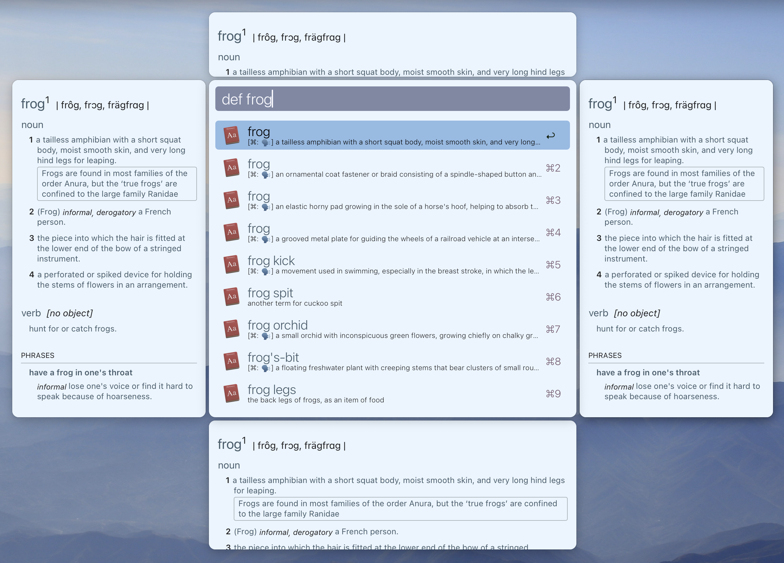
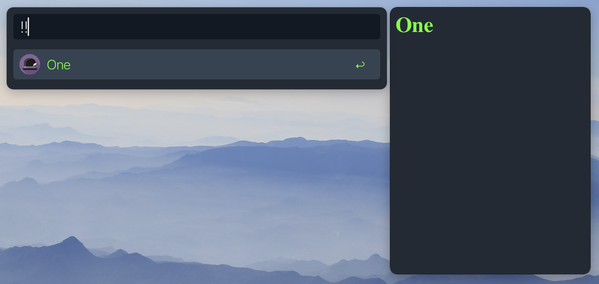

<h1 align="center">
  
<a href="https://github.com/mr-pennyworth/alfred-extra-pane/releases/latest/">
  <br/>
  <br/>
</a>
  AlfredExtraPane
</h1>

Spotight-like rich previews for [Alfred](https://alfredapp.com) workflows.


`AlfredExtraPane` is an experimental app that renders HTML from
`quicklookurl` of every item in the JSON produced by
[Alfred Workflows](https://www.alfredapp.com/workflows/).

#### How does it do it?
Alfred has an experimental "[Press Secretary](https://www.alfredforum.com/topic/16111-wip-poc-spotlight-like-rich-preview-pane-for-alfred-workflows/?do=findComment&comment=83222)" to publish
macOS [distributed notifications](https://developer.apple.com/documentation/foundation/distributednotificationcenter). These notifications
contain all the information needed to be able to show the extra pane.

#### Adding to workflow
Any workflow that produces items with `quicklookurl`s that are either
HTML files or HTTP links automatically causes the extra pane to show
up with the `quicklookurl` loaded in it.

#### Alfred theme support
Alfred's themes are stored in JSON files. Here's a snippet from one such file:
```json
{
  "alfredtheme" : {
    "result" : {
      "textSpacing" : 10,
      "subtext" : {
        "size" : 11,
        "colorSelected" : "#6E7073FF",
        "font" : "System Light",
        "color" : "#6E7073E5"}}}}
```

The pane converts this into CSS variables and injects them into the HTML.
The CSS looks like this:
```css
:root {
  --result-textSpacing: 10px;
  --result-subtext-size: 11px;
  --result-subtext-colorSelected: "#6E7073FF";
  --result-subtext-font: "System Light";
  --result-subtext-color: "#6E7073E5";
}
```
As a workflow author, when you generate the HTML, use these
variables in it. The pane will make sure they're injected.
Check out the [toy example](#toy-example) for a quick walk-through.

## What's not yet supported?
 - Configurability
    - Workflows should be able to opt out of the extra pane

## Installation

### Using a Script
Run the following command in the terminal:
```shell
curl -sL https://raw.githubusercontent.com/mr-pennyworth/alfred-extra-pane/main/install.sh | sh
```

### Manual Installation
 - [Download](https://github.com/mr-pennyworth/alfred-extra-pane/releases/latest/)
   and extract `AlfredExtraPane.app.zip`.
 - Move the extracted `AlfredExtraPane.app` to `/Applications`.
 - Right-click on the app, and click `Open`: 
 - Since this app isn't signed with any developer certificate, macOS shows a
   warning. Click `Cancel`: 
 - Again, right-click on the app, and click `Open`.
 - The warning dialog is different this time. It now allows to open the app.
   Click `Open`: 

## Configuration
The global pane(s) can be configured by editing
`{/path/to}/Alfred.alfredpreferences/preferences/mr.pennyworth.AlfredExtraPane/config.json`.
Similarly, pane(s) for individual workflows can be configured by editing
`{workflow-dir}/extra-pane-config.json`. If there are any workflow-specific
panes, the items produced from that workflow will not be shown in the global
panes.

Alternatively, you can use the `Configure > Global` menu to open the global
config JSON file in your default editor. Similarly,
`Configure > [Workflow Name]` opens the workflow-specific config file.


Configurable parameters are:
 - `alignment` (required):
    - `horizontal`
       - `placement`: `left` or `right`
       - `width`: width of the pane
       - `minHeight`: minimum height of the pane
    - `vertical`
       - `placement`: `top` or `bottom`
       - `height`: height of the pane
 - `customUserAgent` (optional): User-Agent string for HTTP(S) URLs
 - `customCSSFilename` (optional): Name of the CSS file to be loaded
   in the pane. The file should be in the same directory as the JSON
   config file.
 - `customJSFilename` (optional): Name of the JavaScript file to be loaded
   in the pane. The file should be in the same directory as the JSON
   config file.
 - `staticPaneConfig` (optional):
   `{"initURL": "https://fixed-url.com", "function": "jsFunctionName"}`
   This pairs well with `customJSFilename`. In this mode, when the pane is
   created for the first time, it loads `initURL`. Then the workflow
   is expected to produce a text file containing the input it wants to
   send to the pane, and set the full path of this text file as the
   `quicklookurl`. The pane will execute the JavaScript function
   `jsFunctionName` with the contents of the text file as the argument.

Here's an example with four panes configured:
```json
[{
  "alignment" : {
    "horizontal" : {"placement" : "right", "width" : 300, "minHeight" : 400}}
}, {
  "alignment" : {
    "horizontal" : {"placement" : "left", "width" : 300, "minHeight" : 400}}
}, {
  "alignment" : {
    "vertical" : {"placement" : "top", "height" : 100}}
}, {
  "alignment" : {
    "vertical" : {"placement" : "bottom", "height" : 200}}
}]
```


## Toy Example
Here's a script filter that produces a result:


This is what you get when you run it: 

Now, let's attch an HTML preview to this result.
Create `/tmp/one.html`:
```html
<html>
  <head>
  </head>
  <body>
    <h1> One </h1>
  </body>
</html>
```
Change the script filter:
```bash
cat << EOF
{"items" : [
  {"title": "One",
   "quicklookurl": "/tmp/one.html"}
]}
EOF
```
And the preview shows up!


Now let's make the preview blend-in with the theme.
Here's a snippet from relevant parts of Alfred's theme:
```json
{
  "alfredtheme" : {
    "result" : {
      "backgroundSelected" : "#00000054",
      "text" : {
        "size" : 22,
        "colorSelected" : "#E1E1E2FF",
        "font" : "System Light",
        "color" : "#A8A8ABFF"}}}}
```

Looking at the variable names in the above JSON, add the style section
to `/tmp/one.html`:
```html
<html>
  <head>
    <style>
      h1 {
          color: var(--result-text-colorSelected);
      }
    </style>
  </head>
  <body>
    <h1> One </h1>
  </body>
</html>
```

Themed preview should show up:


## Tutorial: Search Google as you type
Here's a script filter that builds a Google search URL as you type:


```shell
q="$1"

function urlencode {
  echo -n "$1" \
   | /usr/bin/python3 -c "import sys, urllib.parse; print(urllib.parse.quote_plus(sys.stdin.read()),end='')"
}

url_q=$(urlencode "$1")

cat << EOF
{"items" : [
  {"title": "Search $q",
   "subtitle": "using google.com",
   "arg": "https://www.google.com/search?q=$url_q",
   "quicklookurl": "https://www.google.com/search?q=$url_q"}
]}
EOF
```

Connecting this script filter to an "Open URL" action
makes sure that pressing enter opens the URL in the default browser:


If `AlfredExtraPane` is running, the preview will show up as you type:


### Customize Pane Placement
The placement of the pane on the right doesn't seem to be the best
choice for this workflow. Let's change it to the bottom. From the
`Configure` menu, open the config file for `Google Search`.

Since we're configuring the pane for this workflow, for the first time,
the file will be empty: 

Let's change it to:
```json
[{
  "alignment" : {"vertical" : {"placement" : "bottom", "height" : 600}}
}]
```

Restarting the app will show the pane at the bottom:


### Show Mobile Version of Google with Custom User-Agent
We see that the desktop version of Google is shown in the preview,
where the text gets clipped on the right, and horizontal scrolling
is needed. Google's mobile version is more suitable for us here.

Let's change the User-Agent to a mobile browser's:
```json
[{
  "alignment" : {"vertical" : {"placement" : "bottom", "height" : 600}}, 
  "customUserAgent": "Mozilla/5.0 (Linux; Android 8.0; Pixel 2 Build/OPD3.170816.012) AppleWebKit/537.36 (KHTML, like Gecko) Chrome/85.0.4183.121 Mobile Safari/537.36"
}]
```

Restarting the app will show the mobile version of Google.
Turns out, the mobile version respects macOS's dark mode too:


### Fine-Tune Webpages with Custom CSS
Precious screen real-estate is wasted by the Google logo and the search
bar. Let's hide them with a custom CSS file.

Create `style.css` in the same directory as the JSON config file:
```css
header {
  display: none;
}
```

Add the `customCSSFilename` key to the JSON config:
```json
[{
  "alignment" : {"vertical" : {"placement" : "bottom", "height" : 600}},
  "customUserAgent": "Mozilla/5.0 (Linux; Android 8.0; Pixel 2 Build/OPD3.170816.012) AppleWebKit/537.36 (KHTML, like Gecko) Chrome/85.0.4183.121 Mobile Safari/537.36",
  "customCSSFilename": "style.css"
}]
```

Restarting the app will show the pane with the Google logo and search
bar hidden:


## Tutorial: Meta AI Image Generation as you type
In "[Tutorial: Google as you type](#tutorial-search-google-as-you-type)"
we saw how to customize position of the pane and style of the webpage. We
could Google as we type, because the search query was a part of the
URL. That meant the workflow only needed to generate the URL, and the
pane would show the preview. 

There are websites where the desired action isn't controlled by the URL.
https://www.meta.ai/ is one such example. It has a text box where you
type the prompt (the prompt must begin with the word "imagine"), and the
AI generates an image based on that prompt, as you type. All this while,
the URL remains the same.

In this tutorial, we will build a workflow and configure the pane such
that the pane loads the URL once, and then listens for the prompt in the
workflow's output, and simulates typing it in the text box. The end
result: 

### Prerequisites
1. You have [installed `AlfredExtraPane`](#installation).
2. You have read 
   "[Tutorial: Google as you type](#tutorial-search-google-as-you-type)"
   and are familiar with configuring the pane.
3. You have a basic understanding of JavaScript (in the web context).
4. You have a Facebook account to log in to Meta AI.

### Configuring Static Pane
Here's the pane configuration for the workflow:
```json
[{
  "alignment" : {"vertical" : {"placement" : "bottom", "height" : 570}},
  "customJSFilename": "flashImagine.js",
  "staticPaneConfig": {
    "initURL": "https://www.meta.ai/",
    "function": "flashImagine"
  }
}]
```
This configuration tells the pane to load `https://www.meta.ai/` once,
and insert the JavaScript from `flashImagine.js` into the loaded webpage.
Then, every time the workflow script filter runs, read query from file
whose path is set as the `quicklookurl`, and pass the query
to the JavaScript function `flashImagine`.

Here's `flashImagine.js`, which defines the `flashImagine` function:
```javascript
function flashImagine(query) {
  let textArea = document.getElementsByTagName('textarea')[0];

  // Calling textArea.value = query won't do as the webpage uses the
  // ReactJS framework.
  // See https://stackoverflow.com/a/46012210 for details.
  // The following code is conceptually equivalent to setting the value
  // of the text area:
  Object.getOwnPropertyDescriptor(
    window.HTMLTextAreaElement.prototype,
    'value'
  ).set.call(textArea, "imagine " + query);

  // When a user manually types in the text area, an "input" event
  // is generated. There's code in the webpage that listens to this
  // event to load the AI generated image. Since in this script, we
  // are setting the value in code (as opposed to manual entry by user),
  // we need to generate the "input" event in code too.
  textArea.dispatchEvent(
    new Event('input', {bubbles: true, cancelable: true})
  );
}
```

### Workflow Script Filter
We have configured the pane, but we still need to create a script filter
that takes the query, writes it to a file, and then produces an item with
the path of the file as the `quicklookurl`:
```shell
q="$1"
input_file="/tmp/meta_ai_input.txt"

echo -n "$q" > "$input_file"

cat << EOF
{"items" : [
  {"title": "$q",
   "quicklookurl": "$input_file"}
]}
EOF
```

That's it! That's the entire workflow (also thrown in a hotkey trigger for
convenience):


### Facebook Login
Running the workflow, we see that the query is being typed into the text
box, but the image isn't showing up:


Meta AI requires you to log in to generate images. Click on the top
left corner of the pane, and log in to Meta AI:


Running the workflow now, we should see the image being generated:


### Refining the Appearance
I don't like how the text box and the padding around the image is taking
up so much space. I don't need to see what's in the textbox as it is the
same as what I've entered in Alfred.

When I looked into the HTML of the webpage, I couldn't figure out how to
style the image so that it covers the entire pane. The `` tags are
deeply buried into many `<div>` tags, whose style prevents us from
applying the absolute positioning to the `` tag.

So, here's a way to do that using JavaScript, where we grab the latest AI
generated image, insert it in a new `` tag, which isn't deeply nested
in the `<div>` tags, and thus, whose style we can control.

Create `style.css` in the same directory as the JSON config file, to
style the new `` tag:
```css
#finalImg {
  position: absolute !important;
  top: 0 !important;
  left: 0 !important;
  width: 100%;
  margin: 0px !important;
  padding: 0px !important;
  z-index: 99999 !important;
}
```

Update the JavaScript with code to create the stylable `` tag:
```javascript
// Create an image tag with "finalImg" as ID, and then
// every 20 milliseconds, look for the latest AI generated image,
// and copy it over to the "finalImg".
(function() {
  var img = document.getElementById("finalImg");
  if (img == null) {
    img = document.createElement("img");
    img.setAttribute("id", "finalImg");
    document.body.insertBefore(img, document.body.firstChild);
    setInterval(function() {
      // The latest image happens to be the last image tag in the webpage.
      let genImgSrc = [...document.getElementsByTagName('img')].reverse()[0].src;

      // handle the case where there aren't any AI generated images.
      if (genImgSrc.startsWith("data:")) {
        img.setAttribute('src', genImgSrc);

        // scroll to the top of the webpage, not really sure what's
        // causing the scrolling down in the first place, but always
        // scrolling to the top means we don't have to worry about it.
        window.scrollTo(0, 0);
      }
    }, 20);
  }
})();

function flashImagine(query) {
   ...
}
```

Add the CSS file to the JSON config:
```json
[{
   "alignment" : {"vertical" : {"placement" : "bottom", "height" : 570}},
   "customJSFilename": "flashImagine.js",
   "customCSSFilename": "style.css",
   "staticPaneConfig": {
      "initURL": "https://www.meta.ai/",
      "function": "flashImagine"
   }
}]
```

Here's the result:


The resultant workflow is hosted at
[`mr-pennyworth/alfred-meta-ai-flash-imagine`](https://github.com/mr-pennyworth/alfred-meta-ai-flash-imagine).
